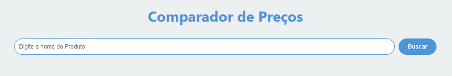
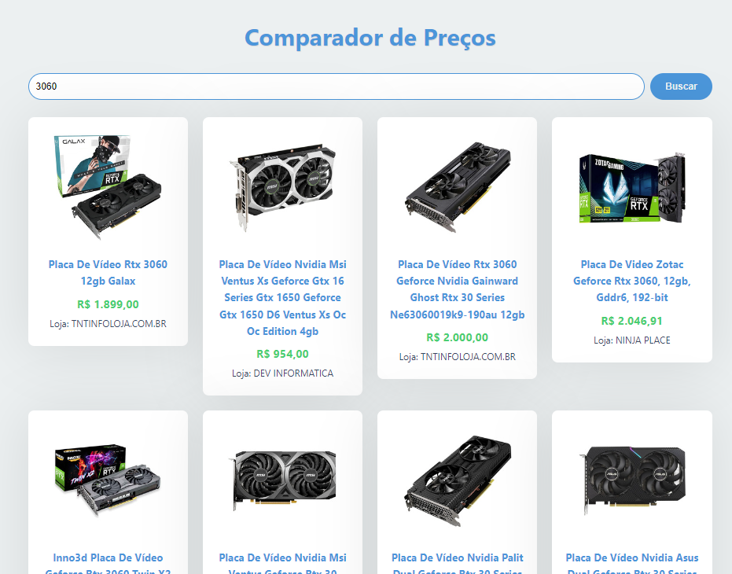
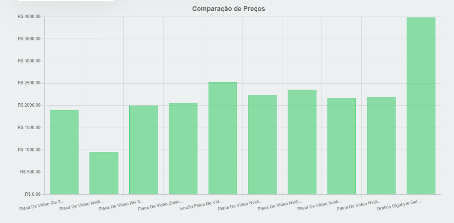

# Comparador de Preços

Veja o projeto em funcionamento: [Comparador de Preços na Vercel](https://comparador-de-precos-rho.vercel.app/)

Este projeto foi desenvolvido com o objetivo de permitir que os usuários pesquisem produtos e comparem preços disponíveis no **Mercado Livre**. A aplicação consulta a API do Mercado Livre para fornecer resultados em tempo real, permitindo que o usuário visualize os melhores preços e redirecione-se para a loja de compra.

## 🛠 Tecnologias Utilizadas

- **React** (versão 18.3.1)
- **Vite** (versão 5.4.8)
- **Axios** para requisições à API
- **Chart.js** para visualização de dados
- **Styled-components** para estilização de componentes
- **ESLint** para análise estática de código

## 🌟 Funcionalidades Principais

- **Pesquisa de Produtos**: O usuário pode digitar o nome de um item e visualizar produtos relacionados.
- **Redirecionamento para Compras**: Ao clicar em um produto, o usuário é redirecionado para a loja de compra.
- **Visualização de Preços**: Um card exibe os preços mais caro e mais barato dos produtos encontrados, utilizando Chart.js para uma apresentação visual clara.
- **Persistência de Dados**: Os dados são apresentados em tempo real a partir da API do Mercado Livre.

## 📸 Imagens e Demonstração

Para melhor ilustrar o funcionamento do projeto, aqui estão algumas imagens prévias da interface principal:





## 🚀 Como Rodar o Projeto

1. Clone o repositório:

   ```bash
   git clone https://github.com/Fabricio-santuchi/Comparador-de-precos.git
   ```

2. Acesse o diretório do projeto:

   ```bash
   cd comparador-de-precos
   ```

3. Instale as dependências:

   ```bash
   npm install
   ```

4. Inicie o servidor de desenvolvimento:

   ```bash
   npm run dev
   ```

5. Acesse o projeto no navegador:

   O projeto será aberto no endereço `http://localhost:5173`.

## 📜 Scripts Disponíveis

- **`npm run dev`**: Inicia o servidor de desenvolvimento.
- **`npm run build`**: Cria uma versão otimizada para produção.
- **`npm run lint`**: Executa o ESLint para verificar erros de código.

## 📂 Estrutura de Pastas

Abaixo está a estrutura de diretórios e arquivos deste projeto:

```bash
PROJETO-COMPARADOR/
│
├── node_modules/          # Dependências do Node.js
├── public/                # Arquivos públicos
│   ├── preview.png        # Imagem de preview do projeto
│   ├── preview2.png       # Imagem2 de preview do projeto
│   └── preview3.png       # Imagem3 de preview do projeto
│
├── src/                   # Diretório principal de código-fonte
│   ├── components/        # Componentes React do projeto
│   │   ├── Cards/         # Componente para exibir informações do produto
│   │   └── GraficoChart/  # Componente para o gráfico de preços
│   ├── App.jsx            # Componente principal do App
│   ├── index.css          # Arquivo de estilos globais
│   └── main.jsx           # Ponto de entrada da aplicação React
│
├── .gitignore             # Arquivo Gitignore
├── eslint.config.js       # Configurações do ESLint
├── index.html             # Ponto de entrada HTML
├── package.json           # Configurações do projeto e dependências
├── package-lock.json      # Arquivo de bloqueio de dependências do npm
├── README.md              # Documentação do projeto
└── vite.config.js         # Configurações do Vite (build tool)
```

## 📦 Dependências

- **React**: Biblioteca JavaScript para construção de interfaces de usuário.
- **React DOM**: Pacote para renderizar componentes React no DOM.
- **Vite**: Ferramenta de build ultrarrápida para projetos front-end.
- **Axios**: Biblioteca para fazer requisições HTTP.
- **Chart.js**: Biblioteca para visualização de dados em gráficos.
- **Styled-components**: Permite estilizar componentes usando CSS-in-JS.

### 🛠 Dependências de Desenvolvimento

- **@types/react** e **@types/react-dom**: Tipos TypeScript para React.
- **ESLint**: Ferramenta para identificar e corrigir problemas no código.
- **Vite Plugin React**: Suporte para React dentro do Vite.

## 📚 Projeto Inspirado

Este projeto foi inspirado em um vídeo do **DevClub**, onde aprendi a implementar um comparador de preços usando a API do Mercado Livre. Você pode conferir o vídeo [aqui](https://www.youtube.com/watch?v=lNf4CUHtEGo&ab_channel=DevClub%7CPrograma%C3%A7%C3%A3o). Agradeço ao DevClub pelo excelente conteúdo que ajudou a aprimorar minhas habilidades em desenvolvimento.

## ✍️ Autor

**Fabrício Santuchi**  
Estudante de **Sistemas de Informação** e desenvolvedor front-end. Apaixonado por criar soluções práticas e funcionais usando as mais recentes tecnologias.
